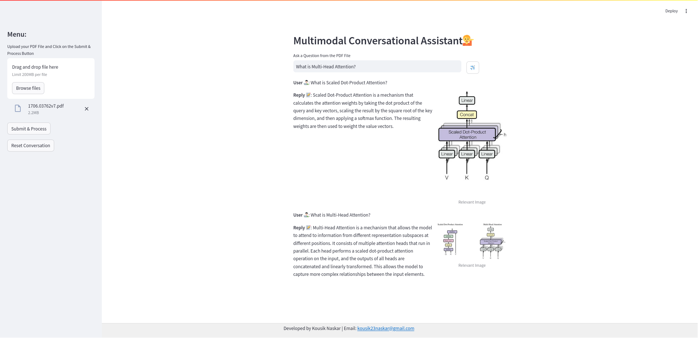

<h1 align="center">🔍 Multimodal Conversational Assistant 📚</h1>
<p align="center">
  
</p>
<p>
  Welcome to the Multimodal Conversational Assistant project! This repository contains code and resources for retrieving information from various sources, specifically focused on uploaded PDF documents. Our goal is to provide an intuitive interface for querying and extracting information effectively, utilizing images, text, and tables.
</p>

## Project Overview 💡
This project leverages document embeddings and generative models to answer user queries in a multimodal context. By utilizing techniques such as vector stores and conversational agents, we aim to provide accurate responses and insights based on uploaded documents. Notably, we use **`unstructured.partition.pdf`** for effective extraction of content from PDFs and **Google Generative AI** for enhanced response generation.

## Tech Stack Used 🛠️
- **Python**
- **LangChain**
- **Streamlit**
- **PyTorch**
- **PIL**
- **dotenv**
- **unstructured**
- **Google Generative AI**

## Dataset 📊
The system retrieves information primarily from:

- **Uploaded PDF Documents:** Users can upload their own documents for personalized information retrieval.

This project focuses on extracting text, tables, and images from PDFs using **`unstructured.partition.pdf`**, enhancing the user's query experience.

## System Functionality 🧑🏻‍💻
The Multimodal Conversational Assistant features:

- **File Uploading:** Users can upload PDF documents for context-aware information retrieval.
- **Conversational Interface:** Users can interact with the system by asking questions related to the uploaded content.
- **Image and Text Summaries:** The system summarizes extracted text and images for more relevant responses.
- **Advanced Response Generation:** Utilizing **Google Generative AI** for dynamic and context-aware answers.

## Usage 💪🏻
To run the project locally, follow these steps:

1. **Clone this repository:**
   ```bash
   git clone https://github.com/kousik23naskar/Multimodal_Conversational_Assistant.git
   ```
2. **Navigate to the project directory:**
  ```bash
  cd Multimodal_Chatbot_with_PDF
  ```
3. **Create a conda environment:**
  ```bash
  conda create -p venv python=3.11 -y
  ```
4. **Activate the environment:**
  ```bash
  conda activate ./venv
  ```
5. **Install the necessary dependencies:**
  ```bash
  pip install -r requirements.txt
  ```
  ```bash
  bash setup.sh
  ```
6. **Run the Streamlit app:**
  ```bash
  streamlit run app.py
  ```
7. **Interact with the app:**
- Open your web browser and go to the URL provided by Streamlit (usually `http://localhost:8501`).
- Use the sidebar to upload your PDF documents and click Submit & Process.
- Ask your questions in the input field and click Generate to receive responses.

## Evaluation 📈
While this project does not currently utilize specific metrics for evaluation, the system's effectiveness is assessed based on its ability to provide relevant answers

## Results and Discussion 📊
In this section, we discuss the performance of the Multimodal Conversational Assistant:

- **Performance**

  - The system effectively prioritizes responses from user-uploaded PDFs, improving the relevance of the information retrieved.
  
- **Strengths:**

  - **Multimodal Capabilities:** Ability to handle text, tables, and images increases the breadth of information retrieval.
  - **User-Friendly Interface:** The Streamlit interface provides an easy way to interact with the system without requiring technical expertise.
  - **Advanced Content Extraction:** Using `unstructured.partition.pdf` ensures comprehensive extraction of relevant information.
  - **Enhanced Responses:** The integration of **Google Generative AI** allows for context-aware and dynamic responses.
  
- **Limitations:**

  - **Dependency on Input Quality:** The accuracy of responses heavily depends on relevance of the uploaded documents.
  
- **Potential Areas of Improvement:**

  - **Enhanced Contextual Understanding:** Improving the model to better understand context and nuances in user queries.
  - **Integration of External APIs:** Adding capabilities to fetch real-time information from external APIs for up-to-date answers.

## Contributing 🤝
We welcome contributions to enhance the project! If you have any suggestions, bug fixes, or new features to add, please submit a pull request. Your contributions are appreciated!

## License 🔐
This project is licensed under the [MIT License](LICENSE).

## Contact 📩
For any questions or inquiries, feel free to reach out to us:
- **Email:** kousik23naskar@gmail.com
- **LinkedIn:** [Kousik Naskar](https://www.linkedin.com/in/dr-kousik-naskar/)

Let’s make seamless multimodal conversation together!

Thank you for visiting our project repository. Happy querying! 😇
